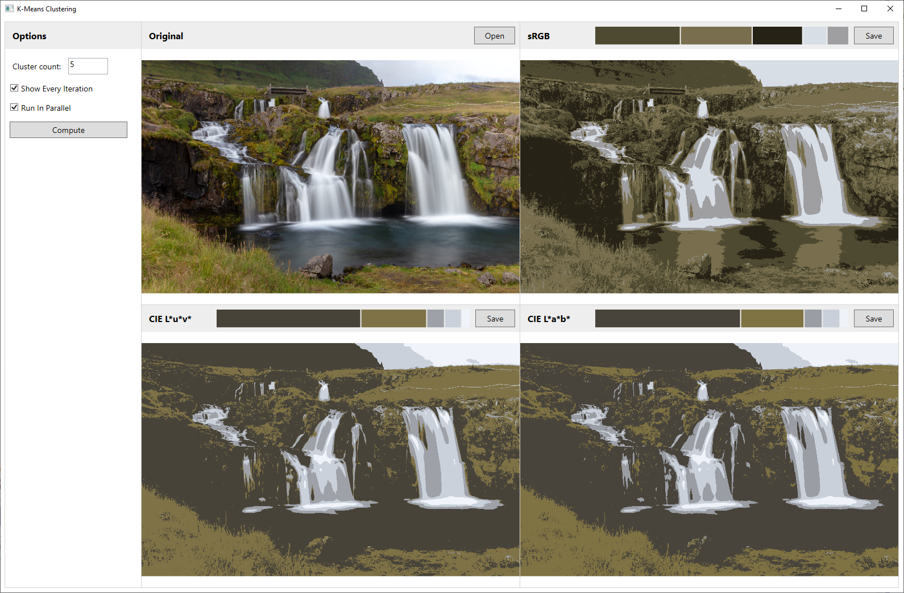

# K-Means Clustering

K-means clustering is an image clustering algorithm that segments the pixels in an image into fixed number of clusters by heuristically maximizing the color distance between each cluster. This project is a WPF application that uses [sRGB](https://en.wikipedia.org/wiki/SRGB), [CIELUV](https://en.wikipedia.org/wiki/CIELUV), and [CIELAB](https://en.wikipedia.org/wiki/CIELAB_color_space) color spaces as 3-space vectors to compute color distance.

## Usage

1. Load any JPG or PNG image using the Load Image button.
1. Choose a number of clusters to compute for each color space, and click the Compute button. The resulting images will begin clustering using each color space as the distance computation.
1. When clustering is complete, each resulting image is shown, along with the color histogram sorted by prominence and weighted by pixel count.

## Implementation Details

The algorithm works in two steps: initial cluster seeding, and cluster iteration.

### Initial cluster selection

There are two steps to the initial cluster seeding.  When requesting *k* < 16 as the cluster count, a 16-cluster image is first computed using [k-means++](https://en.wikipedia.org/wiki/K-means%2B%2B) random seeding for the initial cluster colors. Then, the resulting colors are sorted by prominence, and seeds for the *k* clustering are chosen by taking the most prominent color and then choosing *k*-1 more seeds, where each subsequent color is the one with the greatest minimum distance from the other chosen colors. These *k* colors are then used as the seed input for the *k* clustering.

### Cluster iteration

Cluster iteration assigns each pixel to the cluster that it's closest to. Once every pixel is assigned a cluster, the cluster is updated such that its color is the mean color of all of the pixels assigned to it.

### Termination of iteration

Cluster iteration continues until one of two conditions is met:
1. An iteration completes, and each cluster's new average color is the same (within floating point margin of error) as the previous average.
1. The maximum number of iterations is hit.